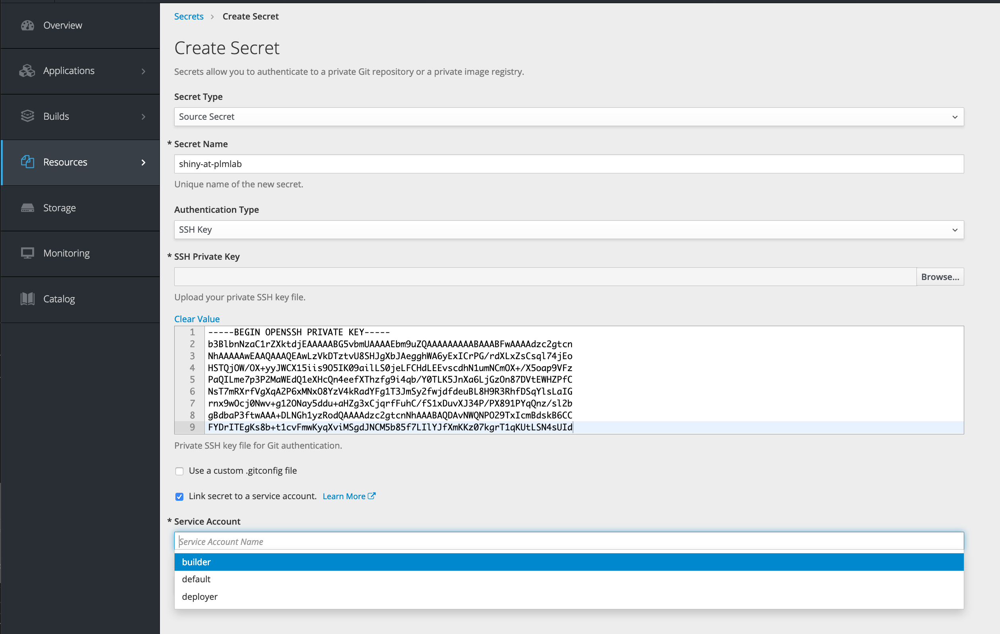

# Serveur ShinyR avec applications personnalisées

- Copiez ce dépôt :
  - git clone plmlab.math.cnrs.fr/plmshift/shiny-custom.git
  - ou bien en cliquant "Fork" sur la page d'accueil de ce dépôt
- Dans le dossier ShinyApps, éditez vos applications Shiny
- Connectez-vous sur https://plmshift.math.cnrs.fr, créez une applications Shiny R depuis le catalogue
- Renseignez l'URL de votre dépôt shiny-custom
  - si votre dépôt est public, l'URL sera de la forme : https://plmlab.math.cnrs.fr/votre_groupe/shiny-custom.git
  - si vous souhaitez un dépôt privé, l'URL sera de la forme : git@plmlab.math.cnrs.fr:votre_groupe/shiny-custom.git
  - dans le cas d'un dépôt privé, vous devez utiliser une "clé SSH de déploiement" (voir ci-dessous) 
- Patientez et ensuite connectez-vous sur l'URL de votre déploiement

# Récupération depuis PLMShift de votre dépôt privé, via une clé SSH de déploiement

Si votre dépôt Shiny Custom est privé, PLMShift devra posséder un secret (ici une clé SSH) afin d'accéder à votre dépôt

cf: https://docs.openshift.com/container-platform/3.11/dev_guide/builds/build_inputs.html#source-clone-secrets

- Générer la clé :
```
ssh-keygen -C "openshift-source-builder/shiny@plmlab" -f shiny-at-plmlab -N ''
```
- Ajoutez la **clé publique** (contenu du fichier shiny-at-plmlab.pub) dans les préférences du dépôt mon_depot/shiny-custom : **Settings->Repository->Deploy Keys**

## En ligne de commande (avec la commande [oc](https://github.com/openshift/origin/releases/latest))
- Ajout de la **clé privé** (contenu du fichier shiny-at-plmlab) dans PLMShift :
```
oc project mon_projet
oc create secret generic shiny-at-plmlab --from-file=ssh-privatekey=shiny-at-plmlab --type=kubernetes.io/ssh-auth
oc set build-secret --source bc/shiny-img shiny-at-plmlab
oc start-build bc/shiny-img
```
La dernière commande ```oc start-build bc/shiny-img``` permet de relancer la fabrication de votre image, car celle-ci a échoué (car la clé SSH n'était pas encore déployée)

## Via la console Web

- Allez sur la console de PLMShift, [sélectionnez votre projet](https://plmshift.math.cnrs.fr/console/projects)
- Onglet Resources->Secrets->Create Secret
  - Pour la rubrique 'Authentication Type' sélectionnez 'SSH Key'
  - Copiez/collez ou téléchargez votre clé privée SSH
  - Pour la rubrique 'Service Account', sélectionnez 'builder'

